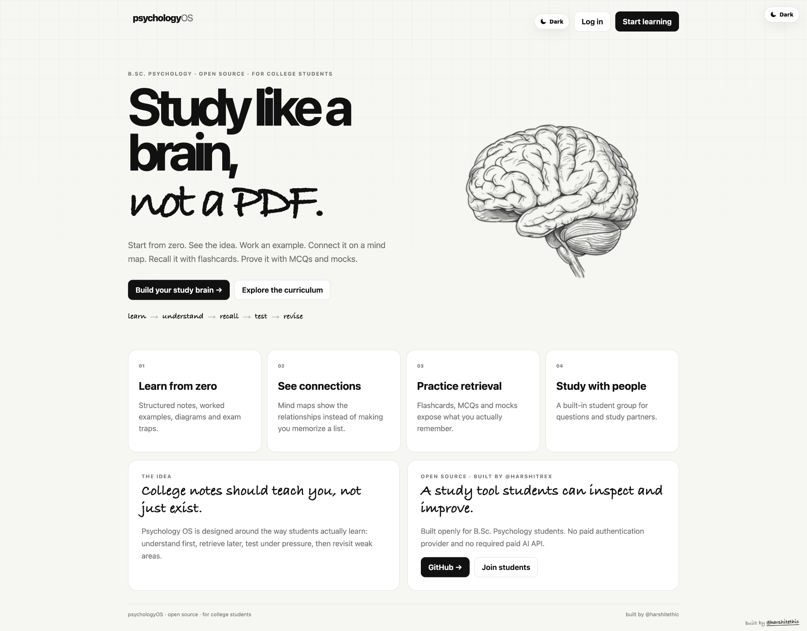
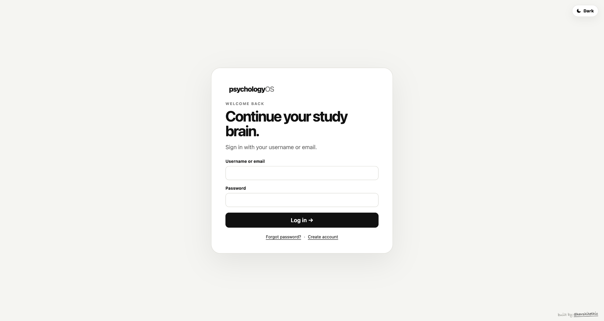
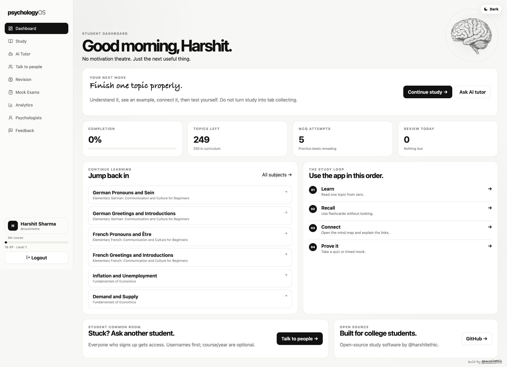
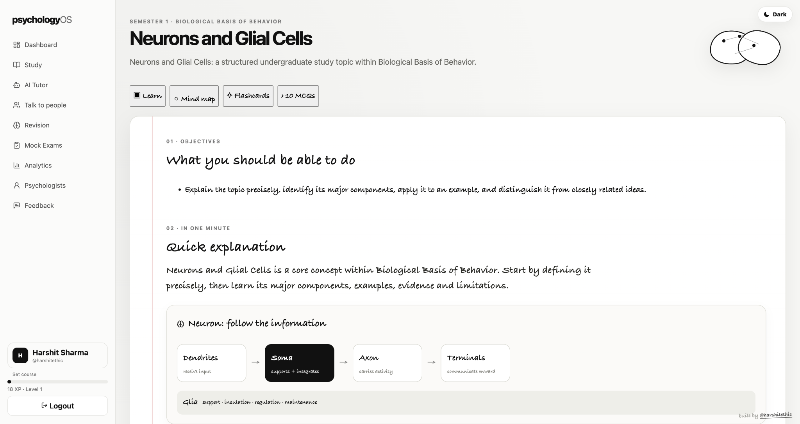
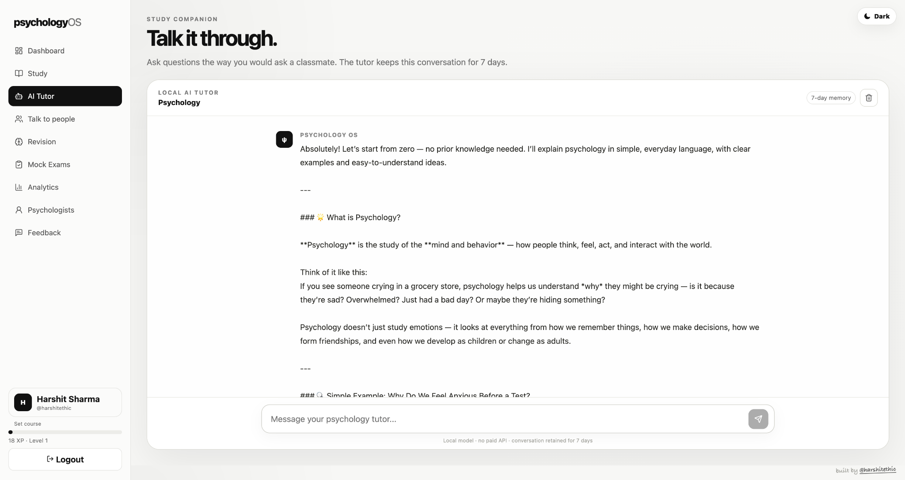
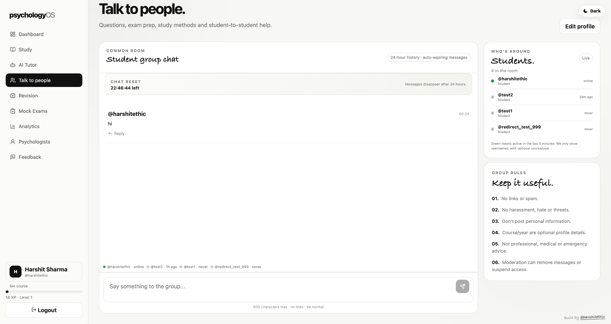
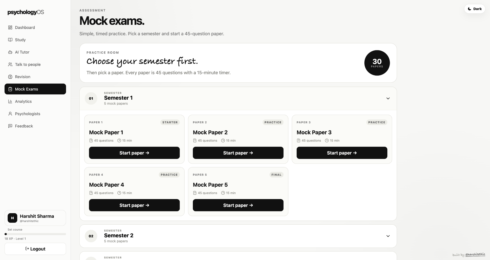

# Psychology Student OS

A full-stack psychology learning platform built to make college study more structured, interactive, and practical.

Psychology Student OS goes beyond static notes with study material, revision tools, flashcards, MCQs, mock exams, progress tracking, search, community features, authentication, admin tools, and a locally-powered AI tutor.

> **Note:** This is an independent educational software project and is not affiliated with any university or institution.

## What it includes

- 📚 Structured psychology topics, units, and study notes
- 🧠 Quick explanations, detailed notes, key terms, and concepts
- 👨‍🔬 Psychologists and their contributions
- 📝 Exam-focused revision material
- 🃏 Flashcards and practice MCQs
- 📊 Mock exams and progress tracking
- 🔎 Study-content search
- 👤 Student profiles and community features
- 💬 Feedback system
- 🤖 AI psychology tutor with local LLM support
- 🔐 Student and admin authentication
- 🛠️ Admin dashboard and moderation tools

## AI Tutor

The local development setup uses [Ollama](https://ollama.com/) for LLM inference, so the standard setup does not require a paid AI API.

Recommended model:

```env
OLLAMA_MODEL=qwen2.5:3b
```

Any Ollama-compatible model can be used by changing the environment variable.

## Tech stack

**Frontend**

- Next.js 15
- React 19
- TypeScript
- CSS
- Lucide React
- Framer Motion
- Recharts / React Flow where needed

**Backend**

- Next.js App Router and API routes
- Prisma ORM
- SQLite
- bcryptjs

**AI**

- Ollama
- Local LLM inference

## Requirements

- Node.js 20+
- npm
- Git
- Ollama (only required for the local AI tutor)

## Getting started

Clone the repository:

```bash
git clone https://github.com/harshitethic/PsychologyOS.git
cd PsychologyOS
```

Install dependencies:

```bash
npm install
```

Create your local environment file:

```bash
cp .env.example .env
```

Generate the Prisma client:

```bash
npx prisma generate
```

Push the database schema:

```bash
npx prisma db push
```

Seed the psychology content:

```bash
npm run db:seed
```

Start the app:

```bash
npm run dev
```

Open `http://localhost:3000`.

### Environment example

```env
DATABASE_URL="file:./dev.db"
SESSION_SECRET="replace-with-a-long-random-secret"
ADMIN_USERNAME="admin"
ADMIN_SESSION_SECRET="replace-with-another-long-random-secret"
OLLAMA_MODEL="qwen2.5:3b"
```

### Start the local AI tutor

In a separate terminal:

```bash
ollama serve
ollama pull qwen2.5:3b
```

## Useful scripts

```bash
npm run dev          # Start the development server
npm run build        # Generate Prisma client and create a production build
npm run start        # Start the production server
npm run db:push      # Push the Prisma schema to the database
npm run db:seed      # Seed psychology learning content
npm run db:studio    # Open Prisma Studio
npm run verify       # Generate Prisma client and type-check the project
npm run doctor       # Validate key project files and environment configuration
npm run smoke        # Run a local HTTP smoke test against the running app
npm run check        # Run the project's type-checking verification
```

## Project structure

```text
PsychologyOS/
├── app/
│   ├── api/
│   ├── ai/
│   ├── dashboard/
│   ├── exams/
│   ├── community/
│   ├── profile/
│   ├── psychologists/
│   ├── revision/
│   ├── search/
│   ├── semesters/
│   ├── topics/
│   ├── login/
│   └── signup/
├── components/
│   ├── AITutorChat.tsx
│   ├── AdminClient.tsx
│   └── Sidebar.tsx
├── lib/
│   ├── auth.ts
│   └── prisma.ts
├── prisma/
│   ├── schema.prisma
│   └── seed.ts
├── public/
├── screenshots/
├── scripts/
├── .github/
│   └── workflows/
│       └── ci.yml
├── next.config.ts
├── package.json
└── README.md
```

## Authentication and data

The app includes student signup/login, username or email login, bcrypt password hashing, HTTP-only sessions, password recovery, admin authentication, and account moderation.

The default Prisma + SQLite setup keeps local development simple. The database can store users, subjects, units, topics, flashcards, MCQs, exam attempts, progress, AI conversations, psychologists, community messages, and feedback.

AI tutor conversations are persisted so recent conversation context can be reused during tutoring sessions. The current implementation keeps tutor conversations for approximately seven days.

## Verification and CI

The repository includes lightweight local checks plus GitHub Actions CI. Every push to `main` and every pull request runs dependency installation, the project verification/type-check step, and the project doctor check.

For local verification:

```bash
npm run check
npm run doctor
```

For a running local server:

```bash
npm run smoke
```

## Security notes

This project is primarily an educational/full-stack development project. Before operating it as a large public service, add production-grade rate limiting, stricter request validation, AI abuse prevention, centralized logging, stronger session management, secure secret management, and more comprehensive automated tests.

Never commit secrets such as:

```text
.env
.env.local
.env.production
```

Do not put API tokens, passwords, private keys, or other credentials into source code.

## Deployment

The web application can run on a standard Linux VPS. The local AI layer can run through Ollama, with performance depending on the chosen model and available CPU/RAM (and GPU when available).

For production deployments, use a production-appropriate database and secret-management strategy rather than relying on local SQLite defaults.

## Why this project exists

The original goal was simple: build a genuinely useful study tool for college psychology coursework.

It became a practical full-stack project covering persistent data, authentication, educational content, exams, progress tracking, search, community features, administration, local AI integration, and deployment workflows.

## Disclaimer

Psychology Student OS is an educational study tool. Its content and AI responses are intended for learning and revision and should not be treated as professional psychological, medical, diagnostic, or clinical advice.

## Screenshots

### Landing page


### Authentication


### Student dashboard


### Topic learning


### AI psychology tutor


### Student community


### Mock exams

